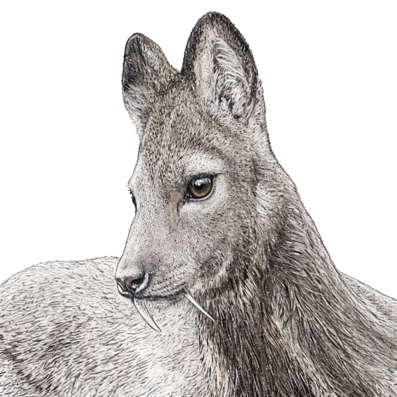

# NORU

**N**NUE **O**n **RU**st — Zero-dependency NNUE training & inference library in pure Rust.

## What is NNUE?

[NNUE](https://www.chessprogramming.org/NNUE) (Efficiently Updatable Neural Network) is a neural network architecture designed for fast evaluation in game engines. Originally developed for Shogi and adopted by Stockfish, NNUE enables real-time neural network inference through incremental accumulator updates.

## What is NORU?

NORU is a **game-agnostic** NNUE library that provides both training and inference in a single, dependency-free Rust crate. Configure your network dimensions at runtime via `NnueConfig` — no recompilation needed.

### Key Features

- **Multi-hidden-layer** — Arbitrary depth networks (e.g. `&[256, 32, 32]`)
- **CReLU + SCReLU** — Squared Clipped ReLU for stronger accumulator activation
- **SIMD-accelerated inference** — AVX2 (x86_64), NEON (aarch64), with scalar fallback
- **Training + Inference** — FP32 backpropagation with Adam optimizer, i16 quantized inference
- **Zero dependencies** — Pure Rust, no PyTorch, no CUDA, no C bindings
- **Game-agnostic** — Runtime-configurable network dimensions via `NnueConfig`
- **Incremental updates** — Efficient accumulator add/remove for search trees
- **Quantization** — Automatic FP32 → i16 conversion for deployment
- **Binary format v2** — Versioned model serialization with auto-detection
- **C ABI / FFI layer** — `cdylib` build + `noru::ffi` for embedding in Unity, Godot, C#, C++

## Quick Start

Add to your `Cargo.toml`:

```toml
[dependencies]
noru = "1.0"
```

### Training

```rust
use noru::config::{NnueConfig, Activation};
use noru::trainer::{TrainableWeights, AdamState, Gradients, TrainingSample, SimpleRng};

// 1. Define your network dimensions
let config = NnueConfig {
    feature_size: 530,         // your game's feature count
    accumulator_size: 256,     // hidden accumulator neurons
    hidden_sizes: &[64],       // hidden layer sizes (multi-layer: &[256, 32, 32])
    activation: Activation::CReLU, // or Activation::SCReLU
};

// 2. Initialize weights
let mut rng = SimpleRng::new(42);
let mut weights = TrainableWeights::init_random(config, &mut rng);
let mut adam = AdamState::new(config);

// 3. Train on samples
let sample = TrainingSample {
    stm_features: vec![0, 42, 100],   // active feature indices (side-to-move)
    nstm_features: vec![10, 50, 200], // active feature indices (opponent)
    target: 0.8,                       // evaluation target
};

let fwd = weights.forward(&sample.stm_features, &sample.nstm_features);
let mut grad = Gradients::new(config);
weights.backward(&sample, &fwd, &mut grad);  // BCE loss
weights.adam_update(&grad, &mut adam, 0.001, 1.0);

// 4. Quantize for deployment
let inference_weights = weights.quantize(); // FP32 → i16
```

### Inference

```rust
use noru::config::{NnueConfig, Activation};
use noru::network::{NnueWeights, Accumulator, FeatureDelta, forward};

// Load quantized weights (v2 format auto-detected)
let weights = NnueWeights::load_from_bytes(&model_bytes, None)?;

// Or with legacy format (requires config)
let weights = NnueWeights::load_from_bytes(&model_bytes, Some(config))?;

// Evaluate a position
let mut acc = Accumulator::new(&weights.feature_bias);
acc.refresh(&weights, &stm_features, &nstm_features);
let eval: i32 = forward(&acc, &weights);

// Incremental update (for search trees)
let mut delta_stm = FeatureDelta::new();
delta_stm.add(new_feature);
delta_stm.remove(old_feature);
acc.update_incremental(&weights, &delta_stm, &delta_nstm);
```

### Save / Load Models

```rust
// Save
let bytes = weights.save_to_bytes(); // v2 format with NORU header
std::fs::write("model.bin", &bytes)?;

// Load (auto-detects v2 header)
let data = std::fs::read("model.bin")?;
let weights = NnueWeights::load_from_bytes(&data, None)?;
```

## Architecture

```
Input (sparse features)
  ↓
Feature Transform: [feature_size] → [accumulator_size] (per perspective)
  ↓
CReLU or SCReLU
  ↓
Concat: [accumulator_size × 2] (STM + NSTM perspectives)
  ↓
Hidden Layer₁ → CReLU → Hidden Layer₂ → ... → Hidden Layerₙ → CReLU
  ↓
Output Layer → 1 (evaluation score)
```

All dimensions are configured at runtime:

```rust
// Simple (single hidden layer)
let config = NnueConfig {
    feature_size: 530,
    accumulator_size: 256,
    hidden_sizes: &[64],
    activation: Activation::CReLU,
};

// Stockfish-style (multi-layer + SCReLU)
let config = NnueConfig {
    feature_size: 768,
    accumulator_size: 1024,
    hidden_sizes: &[256, 32, 32],
    activation: Activation::SCReLU,
};
```

## SIMD Acceleration

Inference is automatically accelerated on supported platforms:

| Platform | Instruction Set | Width | Auto-detected |
|----------|----------------|-------|---------------|
| x86_64 | AVX2 | 256-bit (16 × i16) | Runtime |
| aarch64 | NEON | 128-bit (8 × i16) | Compile-time |
| Other | Scalar | — | Fallback |

No configuration needed — the fastest available path is selected automatically.

## API Reference

### `noru::config`

| Type | Description |
|------|-------------|
| `NnueConfig` | Network dimensions and activation type (static `hidden_sizes`) |
| `OwnedNnueConfig` | Runtime-constructible variant with `Vec<usize>` hidden sizes; convert via `.leak()` |
| `Activation` | Activation function enum (`CReLU`, `SCReLU`) |

### `noru::ffi` (C ABI, optional)

NORU is built as a `cdylib` in addition to `rlib`, producing `libnoru.{so,dylib}` / `noru.dll`. The `noru::ffi` module exposes a C ABI surface for embedding in game engines and other non-Rust hosts:

- **Trainer**: `noru_trainer_new / free / forward / backward_mse / zero_grad / adam_step`
- **Checkpoint**: `noru_trainer_save_fp32 / load_fp32` (FP32 weight serialization)
- **Quantize**: `noru_trainer_quantize` → `NoruWeights` for inference
- **Inference**: `noru_weights_load / save / free`, `noru_accumulator_new / refresh / update / swap / forward`
- **Errors**: `noru_last_error()` returns a thread-local C string for the most recent failure.

All FFI functions return an `i32` status code (`NORU_OK = 0`, negative values for errors) and catch panics at the boundary. See `src/ffi.rs` for the full surface.

### `noru::network` (Inference, i16)

| Type / Function | Description |
|-----------------|-------------|
| `NnueWeights` | Quantized i16 weights for inference |
| `NnueWeights::load_from_bytes()` | Load weights from binary (v2 auto-detect) |
| `NnueWeights::save_to_bytes()` | Save weights to v2 binary format |
| `Accumulator` | Maintains per-perspective activation sums |
| `Accumulator::refresh()` | Full recomputation from feature list |
| `Accumulator::update_incremental()` | Efficient add/remove update |
| `Accumulator::swap()` | Swap STM/NSTM perspectives |
| `FeatureDelta` | Tracks added/removed features for incremental updates |
| `forward()` | Full forward pass: Accumulator → Hidden layers → Output |

### `noru::trainer` (Training, FP32)

| Type / Function | Description |
|-----------------|-------------|
| `TrainableWeights` | FP32 weights with training methods |
| `TrainableWeights::init_random()` | Kaiming initialization |
| `TrainableWeights::forward()` | FP32 forward pass with intermediate results |
| `TrainableWeights::backward()` | Backpropagation (BCE loss) |
| `TrainableWeights::backward_mse()` | Backpropagation (MSE loss) |
| `TrainableWeights::adam_update()` | Adam optimizer step |
| `TrainableWeights::quantize()` | FP32 → i16 for deployment |
| `AdamState` | Adam optimizer momentum/velocity state |
| `Gradients` | Gradient accumulation buffer |
| `TrainingSample` | Training data (features + target) |
| `SimpleRng` | Built-in xorshift64 RNG (no external dependency) |

### `noru::simd`

| Function | Description |
|----------|-------------|
| `vec_add_i16()` | Saturating i16 vector addition |
| `vec_sub_i16()` | Saturating i16 vector subtraction |
| `vec_clipped_relu()` | ClippedReLU activation (clamp to 0..127) |
| `dot_i16_i32()` | i16 dot product with i32 accumulation |
| `dot_screlu_i64()` | SCReLU squared dot product with i64 accumulation |

### `noru::quant`

| Constant / Function | Description |
|---------------------|-------------|
| `WEIGHT_SCALE` (64) | FP32 → i16 quantization scale |
| `ACTIVATION_SCALE` (256) | Accumulator → Hidden scale |
| `OUTPUT_SCALE` (16) | Final output scale |
| `clipped_relu()` | ClippedReLU activation |
| `screlu_f32()` | Squared ClippedReLU (f32) |
| `saturate_i16()` | Safe i32 → i16 conversion |

## Building

```bash
# Library
cargo build --release

# Run tests
cargo test

# Generate documentation
cargo doc --open
```

## Design Decisions

- **No GPU** — Designed for real-time game AI on CPU. NNUE's strength is being fast enough for depth-4+ search on consumer hardware.
- **No external dependencies** — Even the RNG is built-in (xorshift64). This means `cargo add noru` just works, everywhere.
- **SCReLU on first layer only** — Following the Stockfish pattern, SCReLU is applied to the accumulator output. Subsequent hidden layers always use CReLU to avoid numerical issues in narrow layers.
- **Output-major weight layout** — Hidden layer weights are stored transposed (output-major) for contiguous SIMD memory access in dot products.
- **Vec\<T\> over fixed arrays** — All weights use heap-allocated vectors for runtime flexibility. Slight overhead vs compile-time arrays, but enables one binary for any game.
- **Sparse feature input** — Features are passed as active index lists, not dense vectors. This matches NNUE's design for board games where most features are inactive.

## License

Licensed under either of

- [MIT License](LICENSE-MIT)
- [Apache License, Version 2.0](LICENSE-APACHE)

at your option.

## Related Projects

- [Stockfish NNUE](https://github.com/official-stockfish/Stockfish) — The chess engine that popularized NNUE
- [bullet](https://github.com/jw1912/bullet) — GPU-accelerated NNUE training (Rust + CUDA)
- [Rapfi](https://github.com/dhbloo/rapfi) — Gomoku engine with advanced NNUE
